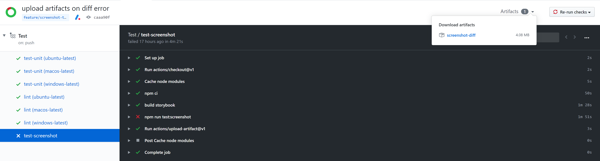

# Screenshot Tests

[[toc]]

We use screenshot tests to ensure that we do not accitently break components visually.

::: warning Challenges

Be aware that each system (OS, version, settings) may render fonts/shadows/gradients differently. You can read more about these issues [here](https://storybook.js.org/docs/testing/automated-visual-testing/#challenges).

:::

## Run screenshot tests

For development, it is recommended to start the storybook dev server with hot reload: `npm run dev:storybook`. Then you can start the screenshot tests with the command: `npm run test:screenshot:jest`

Alternatively you can build the project and start a static server for testing.

```bash
npm run build:storybook
npm run test:screenshot
```

### Get diff for failed tests

When running the screenshot tests they may fail. To find out why, you can check the diff output. For each failed screenshot comparison, there will be a diff image for each failed test located at `tests/screenshot/__image_snapshots__/__diff_output__`.

On CI (GitHub Actions) Build, this directory is made available as an artifact to download. You can find it by going to the failed test run and clicking on artificats in the top right corner.



## Write a screenshot test

Writing a new screenshot test is easy. We snapshot all storybook stories by default. You do not have to do anything.

### Exclude stories from screenshot tests

But some things are not usefull to test with a static screenshot (like a loading spinner). To exclude these stories you can add them to the list of excluded stories.

<<< @/tests/screenshot/ignoredStories.js

### What not to test

In general you should not test:

- dynamic components that move
- text heavy components, because of the challenges explained at the top

## Update screenshots

It happens that you really want to update a component. In this case, you can update the screenshots by running the test command with the `-u` or `--updateSnapshot`. Note the leading double hyphen!

```bash
npm run test:screenshot:jest -- -u
# or
npm run test:screenshot -- -u
```
