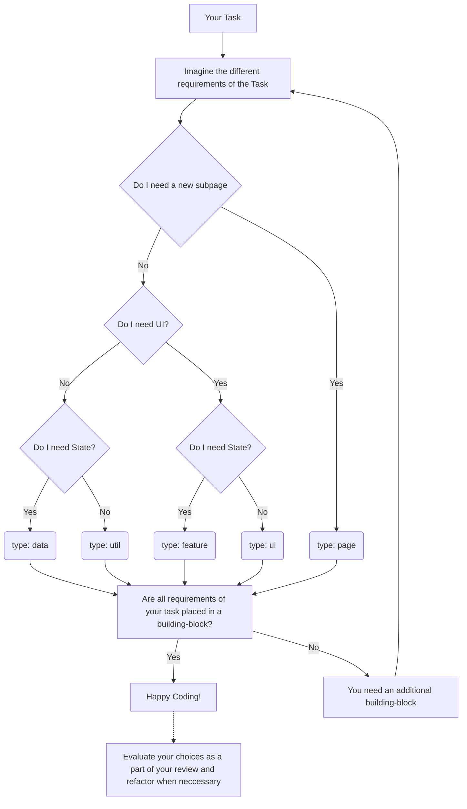

# Project Structure

## Description of the Structure

The projects code is separated into building blocks.

## What is a building-block?

A **building-block** is a "container" were we place most of our applications logic and components. Each building-block is defined by an `index.ts (Barrel-File)` describing it's exported content (public API of a building-block) and a `type`.

Utilizing linting rules and the index.ts we can ensure that each building-block only exposes files which are meant to be used application-wide. This way we achieve a strong separation of concern across the whole application.

Our linting rule is based on the following concept:

[Enforce Project Boundaries | Nx](https://nx.dev/core-features/enforce-project-boundaries)

`Note: in above documentation **libraries** are equivalent to building-blocks and **tags** represent the types defined below.`

## Types of building-blocks

**Page**

Contains a subpage of the application. Orchestrates Feature and UI building-blocks.

`Example: page-dashboard`

**Feature**

Complex features with **stateful / smart components**. Usually specialized to fulfill specific roles in the App. Can also contain presentational components that are specialized for this feature.

`Example: feature-calendar`

**UI**

**Stateless / presentational components** which get their data via props and emit events. Usually less specialized.

`Example: ui-forms`

**Data**

State and API-access. Does not contain any visual components. They are the data-sources of all smart components.

`Example: data-auth`

**Util**

Contains shared low-level code.

`Example: util-form-validators`

## Type: Page

### What is it?

A page building-block represents a **subpage** of the application. It contains the layout component and orchestrates feature and ui building blocks to create a subpage. It can not be imported into any other type of building-block. It is **only imported by the vue-router** and should be **lazy-loaded** if possible.

### Naming Convention

Placed in folder **page**

### Can import types

data, util, ui, feature

## Type: Feature

### What is it?

A feature building-block contains a set of files that represent a business use case in an application.

Most of the components of features are **stateful / smart components** that interact with data sources. This type also contains most of the UI logic, form validation code, etc.

### Naming Convention

Placed in folder **feature**

### Can import types

data, util, ui, feature

## Type: UI

### What is it?

A ui building-block mainly contains **Stateless / presentational components** which are used all across the application. They don't have access to stores and do not use features in their templates. All data needed for components in ui building-blocks comes from props.

### Naming Convention

Placed in folder **ui**

### Can import types

util, other ui

## Type: Data

### What is it?

A data building-block contains **stores and api-services**. It does not contain any view components. They serve as data-sources for feature and page building blocks.

### Naming Convention

Placed in folder **data**

### Can import types

util, other data

## Type: Util

### What is it?

A utility building-block contains **low level code** used by many building-blocks. Often there is no framework-specific code and the building-block is simply a collection of types, utilities, pure functions, factories or composables.

### Naming Convention

Placed in folder **util**

### Can import types

other util

# How to pick the correct type for my Task

`To render this graph in VS-Code markdown preview install this extension: bierner.markdown-mermaid`

# Matrix of allowed imports

| Allowed to Import ➡  It is ⬇ | page | feature | data | ui  | util |
| ------------------------------- | ---- | ------- | ---- | --- | ---- |
| page                            |      | ✔       | ✔    | ✔   | ✔    |
| feature                         |      | ✔       | ✔    | ✔   | ✔    |
| data                            |      |         | ✔    |     | ✔    |
| ui                              |      |         |      | ✔   | ✔    |
| util                            |      |         |      |     | ✔    |
