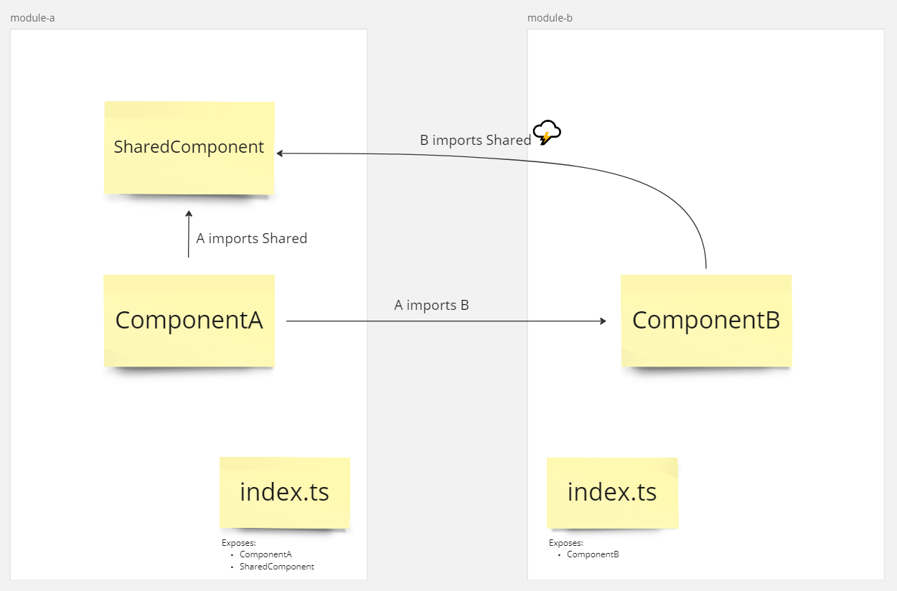
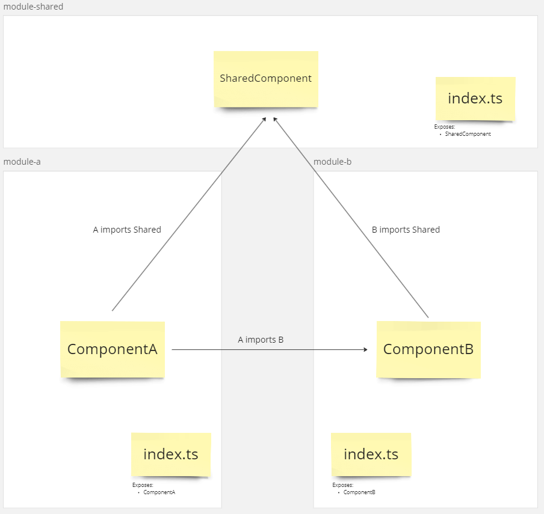
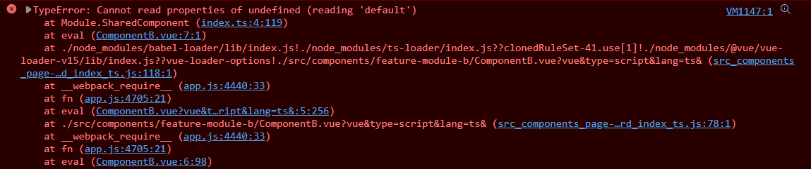
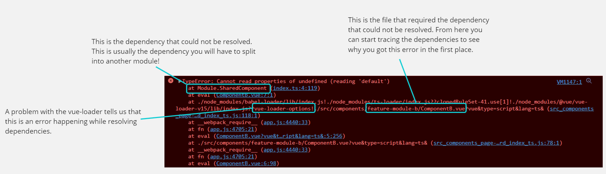

# Identifying and Resolving Circular Dependencies

## What is a circular dependency?
Circular depencies are a common issue when working with barrel-files (index.ts). 

Let's look at a common dependency pattern: 

In this example there are two **Building-Blocks** (e.g. folders that have a barrel file) which depend on each other. Using the SharedComponent in both Building-Blocks will result in a circular dependency.

That basically means that the compiler can not resolve the order to load the Building-Blocks which causes an error. 

## Resolving Circular Dependencies

The basic gist is: **break the circle** and separate the shared dependency in a separate module.

In this configuration the compiler can find an order to resolve the building-blocks correctly.

## How to identify Circular Dependencies in Vue

I recreated the first example error in Vue. When Vue tries to render ComponentA I see the following Error in the console:

This can be quite hard to decipher on a first glance but it contains all the info we need to identify the root cause of the circular dependency.

Based on the info from the message we can learn that ComponentB "closed the circle" by importing SharedComponent. From there we can trace back to see where SharedComponent is exposed and why it depends on ComponentB. In this case it is because they are both imported in ComponentA.

Keep in mind that the circular dependency can involve multiple building-blocks.

