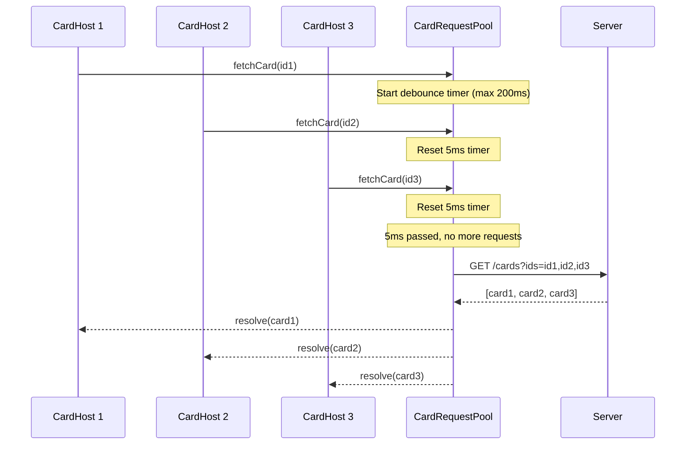

# Technical Handover: Board Frontend

## 3. Data Layer

The data layer is the heart of the board module. It manages all state, handles communication with the backend, and provides composables that UI components use. Understanding this layer is crucial for working on the board feature.

### 3.1 Pinia Stores

The board uses two main Pinia stores that work together. The separation exists because the board structure (columns, card positions) and card content have different loading patterns and lifecycles.

**Board Store** ([Board.store.ts](src/modules/data/board/Board.store.ts))

Manages the board structure including columns and card skeletons (cards without their full content). The board store is loaded first when a user navigates to a board, providing the structural overview:

```typescript
const board = ref<Board | undefined>(undefined);
const isLoading = ref<boolean>(false);

// Uses socket or REST based on feature flag
const socketOrRest = isSocketEnabled ? useBoardSocketApi() : restApi;
```

**Card Store** ([Card.store.ts](src/modules/data/board/Card.store.ts))

Manages card content and elements. Cards are loaded lazily—only when they become visible or when explicitly requested. This improves initial load performance for boards with many cards. The card store maintains a cache of loaded cards, keyed by card ID.

### 3.2 Socket vs REST API Abstraction

The board can operate in two modes: real-time (WebSocket) or traditional (REST). This flexibility exists for fallback scenarios and testing purposes. Both implementations expose the same interface, so the rest of the application doesn't need to know which mode is active.

Both APIs implement the same interface, allowing seamless switching:

```typescript
// Board.store.ts
const isSocketEnabled = useEnvConfig().value.FEATURE_COLUMN_BOARD_SOCKET_ENABLED;
const socketOrRest = isSocketEnabled ? useBoardSocketApi() : restApi;
```

**Info**: the REST-API for the board could be removed.

API implementations:
- [boardSocketApi.composable.ts](src/modules/data/board/boardActions/boardSocketApi.composable.ts) - Sends requests via WebSocket, receives responses and broadcasts
- [boardRestApi.composable.ts](src/modules/data/board/boardActions/boardRestApi.composable.ts) - Traditional HTTP calls with manual state updates

### 3.3 Action Factory Pattern

To maintain type safety and consistency across socket events, the board uses an action factory pattern. This pattern is inspired by Redux/NgRx but simplified for our use case. Each action has a defined type and payload structure, making it impossible to dispatch malformed events.

Actions are typed using a factory pattern for type-safe event handling:

```typescript
// boardActions.ts - Define typed actions
export const createCardSuccess = createAction("create-card-success", props<CreateCardSuccessPayload>());

// boardSocketApi.composable.ts - Handle actions
handle(action,
    on(BoardActions.createCardSuccess, boardStore.createCardSuccess),
    on(BoardActions.createCardFailure, reloadBoard),
);
```

[ActionFactory.ts](src/types/board/ActionFactory.ts)

**How it works:** When a socket event arrives, the `dispatch` function iterates through all registered handlers. If the event type matches, the corresponding callback is executed with the typed payload. This creates a clean separation between event reception and state updates.

**Hint**: socket.io has evolved over time and supports 

### 3.4 Card Request Pooling

When a board loads, many cards need to be fetched. Instead of making one API call per card (which would overwhelm the server), the card request pool batches requests together. This is a critical performance optimization.



```typescript
// CardRequestPool.composable.ts
const MAX_CARDIDS_PER_REQUEST = 100;
const WAIT_AFTER_LAST_CALL_IN_MS = 5;
const MAX_WAIT_BEFORE_FIRST_CALL_IN_MS = 200;
```

**How the pooling works:**
1. When a component requests a card, the request is added to a pool
2. The pool waits briefly (5ms after last request, max 200ms total) for more requests
3. All collected card IDs are sent in a single batch request (max 100 per request)
4. Results are distributed back to the original requesters via Promise resolution

This approach reduces dozens of API calls to just a few, significantly improving page load time.

[CardRequestPool.composable.ts](src/modules/data/board/CardRequestPool.composable.ts)
