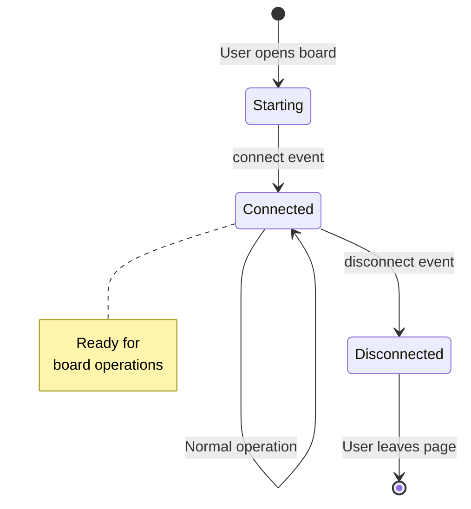
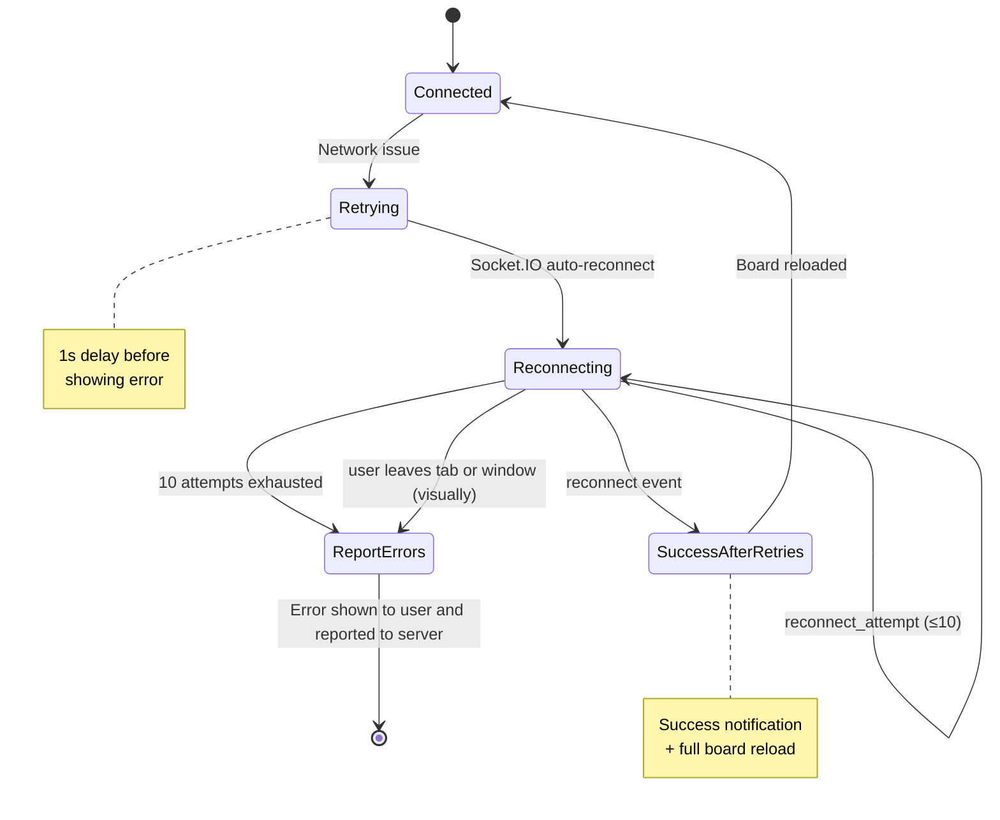
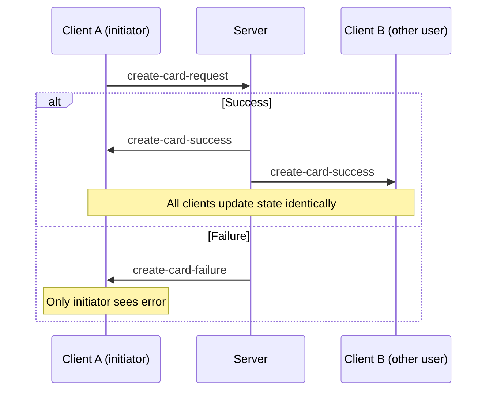

# Technical Handover: Board Frontend

## 4. Socket Connection & Real-time Collaboration

Real-time collaboration is what makes the board feel responsive and collaborative. Multiple users can edit the same board simultaneously, seeing each other's changes instantly. This section explains how the WebSocket connection is managed and how errors are handled.

### 4.1 Connection Setup

The socket connection is established when a user first interacts with a board. It uses Socket.IO, which provides automatic reconnection, fallback transports, and room-based broadcasting.

[socket.ts](src/modules/data/board/socket/socket.ts)

```typescript
instance = io(BOARD_COLLABORATION_URI, {
    path: "/board-collaboration",
    reconnection: true,
    reconnectionAttempts: 10,
    withCredentials: true,
});
```

**Configuration explained:**
- `path: "/board-collaboration"` - The server endpoint for WebSocket connections
- `reconnectionAttempts: 10` - Will try to reconnect up to 10 times before giving up
- `withCredentials: true` - Sends cookies for authentication

### 4.2 Connection Lifecycle

The connection goes through various states during a user session. The frontend handles each state to provide appropriate feedback to the user:

| Event | Behavior |
|-------|----------|
| First connect | No notification |
| Disconnect | 1s delay, then error notification |
| Reconnect | Success notification + reload board |
| Tab visible | Auto-reconnect check |

**Connection State Diagram:**



**Error & Reconnect Scenarios:**



**Important:** When the tab becomes visible again after being hidden, the frontend automatically checks the connection and reloads the board if necessary. This ensures users always see the latest state.

### 4.3 Message Pattern

All board operations follow a consistent request-response pattern. Understanding this pattern is essential for adding new operations or debugging issues.



**Request-Response Pattern:**
- Client sends: `{action}-request` (e.g., `create-card-request`)
- Server responds: `{action}-success` or `{action}-failure`
- Success broadcasts to ALL connected clients (so everyone sees the change)
- Failure only to requesting client (so only they see the error)

**Why this matters:** Because success events are broadcast to all clients, the frontend that initiated the action also receives it. This is intentional—it ensures all clients update their state in the same way, preventing inconsistencies.

```typescript
// Emit request
emitOnSocket("create-card-request", { columnId, requiredEmptyElements });

// Handle responses via dispatch
on(BoardActions.createCardSuccess, boardStore.createCardSuccess),
on(BoardActions.createCardFailure, reloadBoard),
```

### 4.4 Error Handling & Reporting

Connection issues in a real-time application can be frustrating for users. The error handler is designed to both recover from issues automatically and provide visibility into problems for debugging.

[socket-error-handler.ts](src/modules/data/board/socket/socket-error-handler.ts)

The error handler performs three key functions:
1. **Logs connection events with timestamps** - Creates a timeline of what happened for debugging
2. **Reports errors to backend API for monitoring** - Allows the team to track connection issues across all users
3. **Sends logs on tab hide or page unload** - Ensures we capture data even when users navigate away

```typescript
enum ConnectionState {
    STARTING, CONNECTED, RETRYING, DISCONNECTED,
    RECONNECTING, SUCCESS_AFTER_RETRIES, FAILED_AFTER_MAX_ATTEMPTS
}
```

**Error reporting to backend:**
```typescript
boardErrorReportApi.boardErrorReportControllerReportError({
    type, message, url, boardId, retryCount, logSteps
});
```

This error reporting is debounced (7 seconds) to avoid overwhelming the server during connection turbulence. The collected logs include transport type (websocket vs. polling), connection state transitions, and error messages.