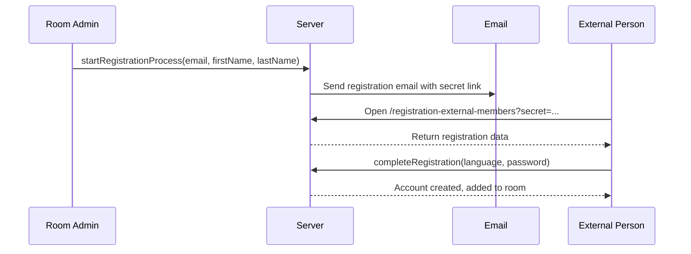

# Technical Handover: Room - Frontend

## 9. External Person Registration

External persons (teachers from other schools without accounts) can be invited via email. This creates a registration flow.

### Flow Overview



### Registration Store ([registration.store.ts](src/modules/data/room/registration/registration.store.ts))

```typescript
// Room admin initiates invitation
const startRegistrationProcess = ({ firstName, lastName, email, roomId }) =>
    registrationApi.registrationControllerCreateOrUpdateRegistration({
        firstName, lastName, email, roomId
    });

// External person completes registration
const fetchUserData = async () => {
    const data = await registrationApi.registrationControllerGetBySecret(registrationSecret.value);
    userData.value = data;
};

const completeRegistration = async (language: LanguageType, password: string) => {
    await registrationApi.registrationControllerCompleteRegistration(
        registrationSecret.value, 
        { language, password }
    );
};

// Admin can manage pending invitations
const fetchRegistrationsForCurrentRoom = async () => ...
const removeInvitations = async (invitationIds: string[]) => ...
const resendInvitation = async (registrationId: string) => ...
```

### Registration Steps

The external person goes through these steps:
1. **Welcome** - Introduction page
2. **Language Selection** - Choose interface language
3. **Password** - Set account password
4. **Consent** - Accept terms
5. **Success** - Account created, redirected to room

These are implemented in `src/modules/feature/room/registration/steps/`.
